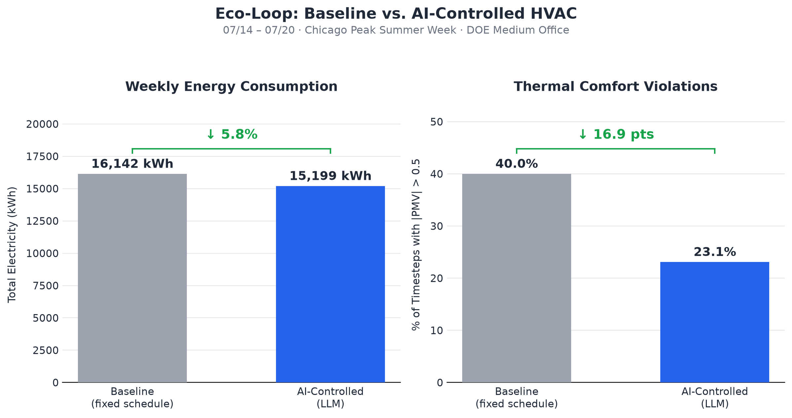

# Eco-Loop: LLM-Driven Closed-Loop HVAC Control via EnergyPlus Co-Simulation

**Problem Statement:** ECO LOOP  BUILDING AGENTS
**Author:** PAULOSTA KARMAKAR

## Overview

Eco-Loop is a supervisory AI control layer that replaces a building's rigid,
fixed-schedule HVAC setpoints with dynamic, context-aware decisions made by
a local open-source LLM. It runs against a real EnergyPlus building energy
simulation (not a simplified surrogate model) — the DOE Reference Medium
Office building in Chicago — reading live zone temperature, occupant thermal
comfort (PMV), and outdoor conditions every simulated hour, then proposing
heating/cooling setpoints through a validated tool-calling interface before
writing them back into the running simulation.

## Repository Note

`dev_validation_scripts/` contains earlier incremental scripts used to
validate each piece of the pipeline independently (sensor reads, actuator
writes, tool validation) during development. The unified, final system is
`tools.py` + `llm_decide.py` + `llm_control.py`.

## Results

Compared against the building's original fixed-schedule baseline over a
representative summer peak week (07/14-07/20, Chicago):

| Metric | Baseline (fixed schedule) | AI-Controlled (LLM) | Change |
|---|---|---|---|
| Total electricity | 16,142.2 kWh | 15,198.7 kWh | **-5.8%** |
| Average PMV | -0.485 | -0.185 | closer to neutral |
| Comfort violations (\|PMV\| > 0.5) | 40.0% | 23.1% | **-16.9 points** |

The AI-controlled run reduced energy consumption **and** nearly halved
thermal comfort violations simultaneously — it did not trade one for the
other.

## Architecture

EnergyPlus Simulation
|
v
Sensing / Feedback (zone temp, PMV, outdoor conditions - read each hour)
|
v
AI Reasoning / Decision (local LLM via Ollama proposes setpoints)
|
v
Control / Actuation (validation layer checks safety bounds, writes
back to EnergyPlus via Actuator API, holds last
known-good setpoint on failure/rejection)
|
+----------------> loops back to EnergyPlus for next timestep

## Tech Stack

- **Python 3.12**
- **EnergyPlus 26.1** (Python Runtime API / `pyenergyplus`) — the real
  industry-standard building energy simulation engine
- **DOE Commercial Reference Building** model (Medium Office, 18 zones),
  Chicago TMY3 weather data
- **Ollama + Llama 3.2** — open-source, locally hosted LLM, no cloud
  API dependency
- **ASHRAE 55 / Fanger PMV** thermal comfort model

## Repository Structure
idf/baseline.idf - building model (RunPeriod trimmed to demo week)
weather/chicago.epw - weather file
tools.py - ToolServer: validated read/write interface
llm_decide.py - LLM decision logic (Ollama client)
llm_control.py - full closed loop: EnergyPlus <-> tools <-> LLM
control_test.py, tool_test.py - earlier development/validation scripts
dashboard.py - baseline vs AI comparison analysis
make_chart.py - generates results_comparison_chart.png
results_comparison_chart.png - final results chart

## How to Run

1. Install [EnergyPlus 26.1](https://github.com/NREL/EnergyPlus/releases)
   and [Ollama](https://ollama.com), then `ollama pull llama3.2`.
2. Update `EPLUS_ROOT` at the top of `llm_control.py` / `tool_test.py` to
   your EnergyPlus install path.
3. Run baseline: `python run_baseline.py`
4. Run AI-controlled: `python llm_control.py`
5. Compare results: `python dashboard.py`
6. Generate chart: `python make_chart.py`

## Key Design Decisions

- **Validation + fallback layer**: LLM proposals are checked against
  ASHRAE 55 deadband and safe temperature bounds before being applied;
  malformed or rejected proposals cause the system to hold the last
  known-good setpoint rather than fail.
- **Throttled decisions**: the LLM is called once per simulated hour
  (zero-order hold between calls), bounding latency and inference cost
  regardless of simulation timestep resolution.
- **Building-wide control**: all 15 occupied zones in this reference
  building share two setpoint schedules, so one heating/cooling decision
  controls the whole building. Per-zone control is a natural extension
  using the same tool interface.

## References

- U.S. DOE, EnergyPlus Simulation Software — https://energyplus.net
- Deru, M. et al. (2010), *U.S. DOE Commercial Reference Building Models
  of the National Building Stock*, NREL/TP-5500-46861
- ASHRAE Standard 55 — Thermal Environmental Conditions for Human Occupancy
- Fanger, P.O. (1970), *Thermal Comfort: Analysis and Applications in
  Environmental Engineering*
- Ollama — https://ollama.com
